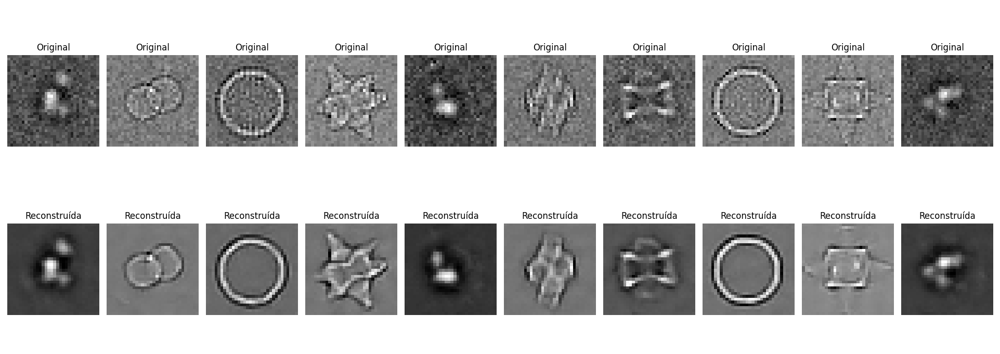
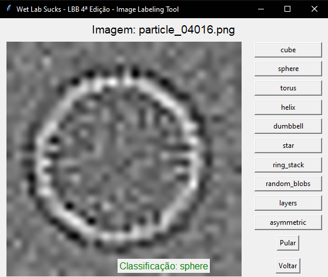
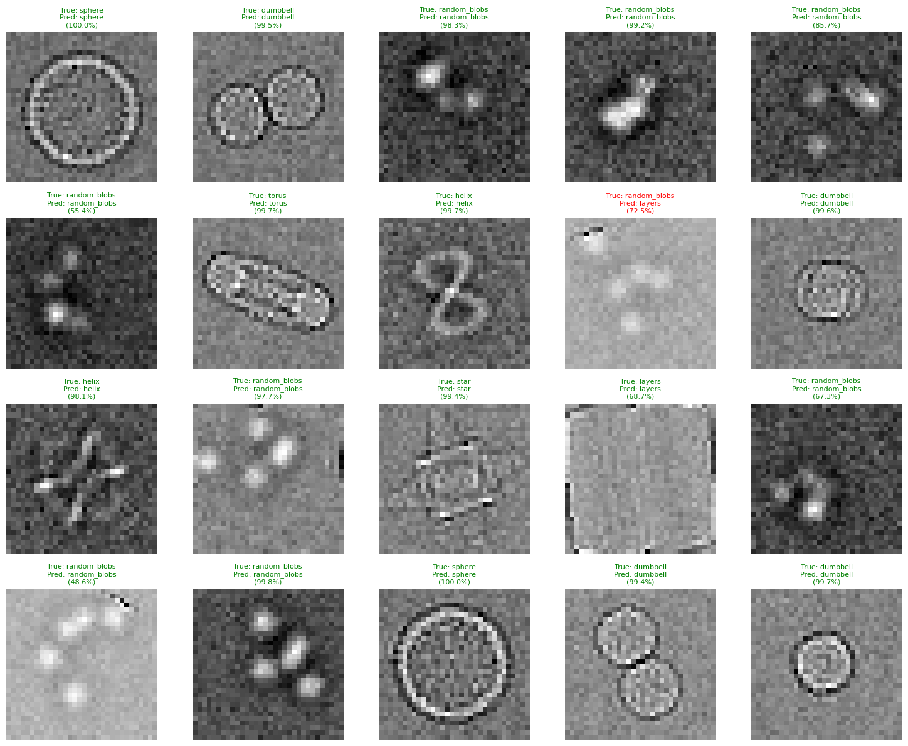
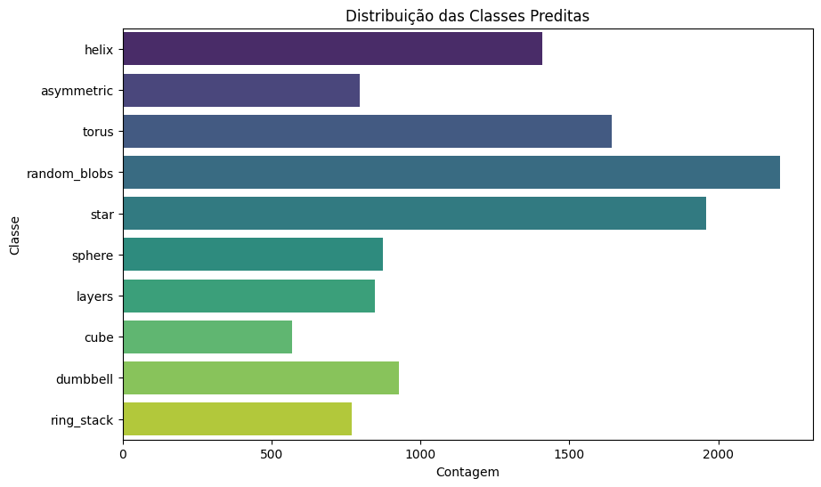
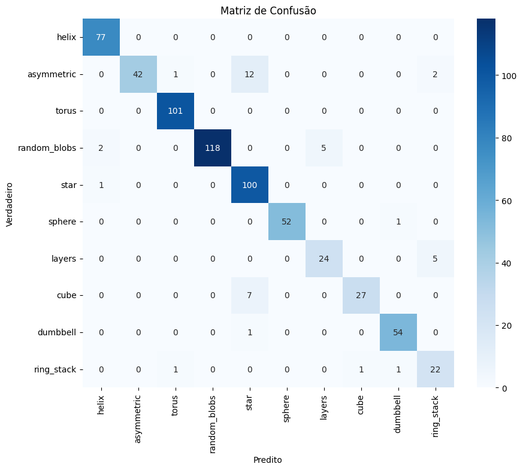
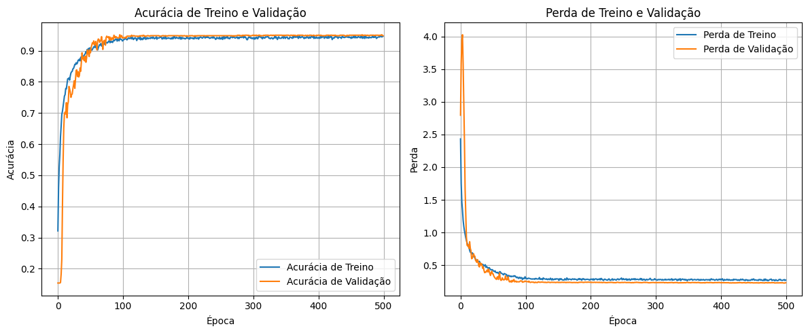

# Desafio 1.1: Classificação Geométrica de Partículas

## Descrição do Desafio

Durante a fase 2 da Liga Brasileira de Bioinformática de 2025, fomos desafiados a classificar imagens 2D (12x12 px) de partículas de Cryo-EM em uma das 10 classes geométricas (`cube`, `sphere`, `torus`, `helix`, `dumbbell`, `star`, `ring_stack`, `random_blobs`, `layers`, `asymmetric`).  
O objetivo era simular a etapa de classificação de partículas, fundamental no pipeline de Single Particle Analysis (SPA) para separar diferentes estruturas antes da reconstrução 3D.
>[!NOTE]
>Como entrada recebemos 12.000 imagens de partículas projetadas em ângulos aleatórios.

## Nossa estratégia

Inicialmente, exploramos abordagens de *unsupervised learning* utilizando [**Autoencoders**](https://en.wikipedia.org/wiki/Autoencoder) e **Multi-scale Autoencoders** na tentativa de:
1.  Comprimir as imagens em um espaço latente de menor dimensão.
2.  Utilizar algoritmos de clusterização (como K-Means) nesse espaço latente para agrupar imagens semelhantes.

Embora tivéssemos a expectativa de que Autoencoders poderiam ser eficazes para representar as imagens em vetores menores e, consequentemente, facilitar a separação por K-Means, observamos uma **baixa acurácia** nas classificações. 
>[!NOTE]
>Este é um exemplo de recronstrução das imagens originais utilizando nosso [multi-scale autoencoder](src/autoencoder.py)
>

Além disso, necessidade de mapear manualmente os clusters para as classes verdadeiras (`cluster_1` -> `cube`, por exemplo) também se mostrou um gargalo e uma fonte potencial de erros.  

Diante desses desafios e buscando uma solução mais eficiente, tomamos a decisão de mudar a abordagem para **Supervised Learning**.

## Solução Final: Rede Neural Convolucional (CNN) Supervisionada

Para implementar a abordagem supervisionada, foi necessário construir um dataset rotulado. Para isso, desenvolvemos uma **interface gráfica simples (GUI)** para acelerar o processo de *labeling* manual das imagens.  

>[!NOTE]
>Nossa equipe classificou um total de **6.563 imagens** (54.7% do dataset disponibilizado).

Com este dataset rotulado, projetamos e treinamos uma **Rede Neural Convolucional (CNN)** utilizando TensorFlow.  

>[!IMPORTANT]
TLDR: A arquitetura da nossa CNN possui 3 camadas convolucionais com regularização L2, funções de ativação Leaky ReLU, normalização de *batch* e *dropout* para prevenir *overfitting*. Considerando que estamos participando de uma competição onde o tempo é importante, adotamos a inclusão de callbacks no treinamento, como `EarlyStopping`, `ModelCheckpoint` e `ReduceLROnPlateau`.

> Aqui é possível entender melhor a nossa arquitetura: [CNN.py](src/CNN.py)

### Resultados Obtidos

Nosso modelo CNN alcançou uma **acurácia de ~94%** no conjunto de teste, demonstrando excelente capacidade de classificar as imagens de partículas nas 10 classes geométricas.

Abaixo estão alguns dos resultados e métricas que comprovam o desempenho do modelo:

* **Exemplos de Predições:** Visualização de algumas imagens do conjunto de teste com suas classes verdadeiras, classes preditas e confiança.
    
  
* **Distribuição das Classes Preditas:** Gráfico da contagem de previsões por classe, indicando a distribuição das previsões do modelo.
    
  
* **Matriz de Confusão:** Visualização da performance do classificador, mostrando as verdadeiras classes versus as classes preditas.
    

* **Histórico de Treinamento (Acurácia e Perda):** Gráficos que mostram a evolução da acurácia e da perda durante o treinamento e validação do modelo.
    
